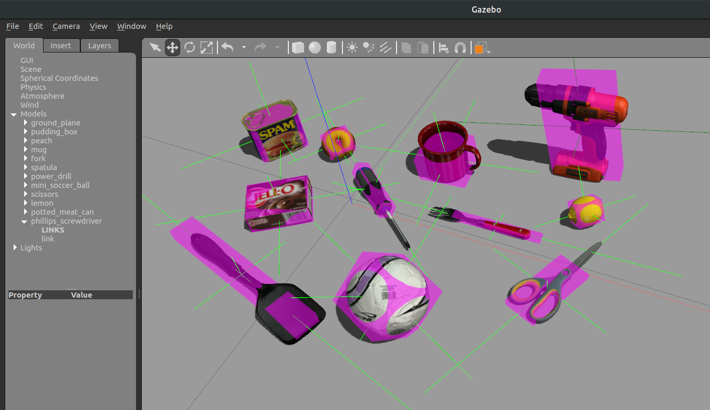

# YCB Tools
Tools to download models from the [YCB dataset](https://www.ycbbenchmarks.com/) and use them with the Gazebo simulator.

By Sebastian Castro, 2020



## Python Setup

You only need to install a few Python packages to get these tools running.

```
pip install numpy pillow scipy shapely trimesh
```

## Downloading YCB objects

You can download the models using a variant of the download script provided on the YCB site. However, this script has been modified to work with Python 3.

```python
python download_ycb_dataset.py
```

You can configure a few options in the script, including choosing which objects and model types to download. However, the default options will get all of the YCB object models and may take a few minutes to download.

## Using YCB Object Models in Gazebo

After you have downloaded the YCB models, you can run the following script, ensuring you have set the folder names at the top to match your environment.

```python
python create_ycb_sdf.py
```

There is a `downsample_ratio` parameter set in this script which uses rejection sampling to randomly remove faces from the mesh to get a subset of faces. This downsampled mesh is used only for collision detection, so it will not affect the visuals, but it should make simulation faster if you don't need perfect collision fidelity. The Google 16k meshes are fairly high-resolution, so this should not have a huge impact, but if you want the full meshes used for collision, you can set this parameter to `1`.

**NOTE:** A few of the models in the dataset do not have either of the `google_16k` or `tsdf` meshes available, so these will not work with Gazebo.

Finally, you need to make sure the folder containing your models is included in your `GAZEBO_MODEL_PATH` environment variable. We recommend setting this in your `~/bashrc` file as follows.

```
export GAZEBO_MODEL_PATH=$GAZEBO_MODEL_PATH:$REPO_BASE_FOLDER/models/ycb
```

where `$REPO_BASE_FOLDER` is the folder containing this README file.
